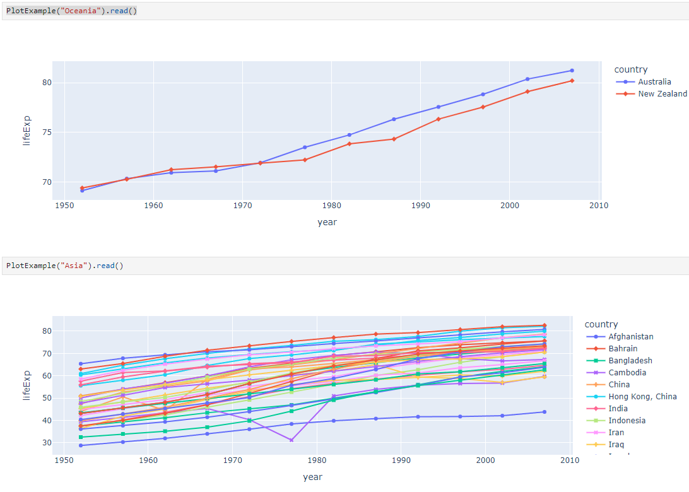

# TethysDash

This app was created using an experimental Tethys + React app scaffold. It uses React for the frontend of the app and Tethys as the backend.

## Development Installation

You need to install both the Tethys dependencies and the node dependencies:

1. Install the app in Tethys Platform

```
conda activate tethys
cd tethysapp-tethysdash
tethys install -d
```

2. Install the node and dependencies

```
cd tethysapp-tethysdash
npm install --dev
```

## Development

The webpack dev server is configured to proxy the Tethys development server (see `webpack.config.js`). The app endpoint will be handled by the webpack development server and all other endpoints will be handled by the Tethys (Django) development server. As such, you will need to start both in separate terminals.

1. Start Tethys development server

```
tethys manage start
```

2. Start webpack development server (in separate terminal)

```
npm start
```

## Build

Webpack is configured to bundle and build the React app into the `tethysapp/<app_package>/public/frontend` directory. Before building a Python distribution for release, you should build using this command:

```
npm run build
```

## Test

Use the following commands to lint and test the React portion of the app.

```
npm run lint
npm run test
```

The linting capability is powered by [eslint](https://eslint.org/) and a number of plugins for React. The testing capabilities include [jest](https://jestjs.io/), [jsdom](https://github.com/jsdom/jsdom#readme), [testing-framework](https://testing-library.com/), [user-event](https://testing-library.com/docs/user-event/intro/), and a few other JavaScript testing utilties to make it easy to test the frontend of the React-Tethys app.

## Visualization Plugins

Dashboard visualizations plugins are based on the [intake](https://github.com/intake/intake) python package and can be developed following the information found in the [Making Driver](https://intake.readthedocs.io/en/latest/making-plugins.html) documentation.

This section will cover the requirements needed to make plugins specifically for this application, including necessary setup, properties, and methods. An example plugin can be found [here](https://github.com/FIRO-Tethys/tethysdash_plugin_usace/tree/main).

### Developing

#### Repository

Before developing a plugin, you will need to create a new repository for the plugin. This will ensure that others users can clone and install the package as needed. The file structure is up to the developer but the repository must include a setup.py, which will be addressed in the [installing](#installing) section.

#### Intake DataSource Class

The focus of the development will be creating a new intake driver and datasource in the form of a python class. Below is an example of a simple intake driver example

```
from intake.source import base
import plotly.express as px

class PlotExample(base.DataSource):
    container = 'python'
    version = '0.0.1'
    name = 'plot_example'
    visualization_args = {"continent": "text"}
    visualization_group = "Example"
    visualization_label = "Example Plot"
    visualization_type = "plotly"

    def __init__(self, continent, github_kwargs={}, metadata=None):
        self.continent = continent
        super(PlotExample, self).__init__(metadata=metadata)

    def read(self):
        """Return a version of the xarray with all the data in memory"""
        df = px.data.gapminder().query(f"continent == '{self.continent}'")
        fig = px.line(df, x='year', y='lifeExp', color='country', symbol="country")
        return fig
```

The container, version, and name properties are all required by intake. For a more in depth review of properties and classes for base.DataSource, refer to the intake [documentation](https://intake.readthedocs.io/en/latest/making-plugins.html).

Properties:

- <b>container</b>: This will almost always be "python" which means the intake driver will return a python object.
- <b>version</b>: version of the package
- <b>name</b>: name of the package. This is the name that will be used for installation. In order to use the driver, you will call `intake.open_<driver_name>`.
- <b>visualization_args</b>: This a property specific for the dashboard app. This is a dictionary containing the function arguments as keys with the data type as the value. This dictionary will be parsed in the application to dynamically create html inputs for the users. Values can be [HTML Input Types](https://www.w3schools.com/html/html_form_input_types.asp) or a list of values for a dropdown menu (i.e. `{"year": "number", "location": "text", "available_colors": ["red", "blue", "white"]}`).
- <b>visualization_group</b>: This a property specific for the dashboard app. List visualizations in the dashboard application will be grouped based on this property.
- <b>visualization_label</b>: This a property specific for the dashboard app. Describes the formal name of the visualization that will be displayed in the visualization list in the dashboard app.
- <b>visualization_type</b>: This a property specific for the dashboard app. Desribes the type of visualization this is created. Can be "plotly", "table","image", "card", "map", "custom". If another type is desired for the users, submit an issue in this repository requesting the new chart type.

Methods:

- <b>**init**</b>: This is a typical python class **init** method. Set any class specific properties here for the visualization, such as the "continent" property in the example above.
- <b>read</b>: This is the main function that developers will want to focus on. The dashboard app will call this method and use the results as the visualization data.

#### Plugin Data Structure

The five different plugins requires the data to be send with an specific structure for the Tethysdash application to render them

##### `plotly`

A dictionary containing a `data` and `layout` attribute are needed.

```python
data = [
    {
        'type': 'scatter',  # all "scatter" attributes: https://plotly.com/javascript/reference/#scatter
        'x': [1, 2, 3],     # more about "x": #scatter-x
        'y': [3, 1, 6],     # #scatter-y
        'marker': {         # marker is an object, valid marker keys: #scatter-marker
            'color': 'rgb(16, 32, 77)' # more about "marker.color": #scatter-marker-color
        }
    },
    {
        'type': 'bar',      # all "bar" chart attributes: #bar
        'x': [1, 2, 3],     # more about "x": #bar-x
        'y': [3, 1, 6],     # #bar-y
        'name': 'bar chart example'  #bar-name
    }
];

layout = {                     # all "layout" attributes: #layout
    'title': 'simple example',  # more about "layout.title": #layout-title
    'xaxis': {                  # all "layout.xaxis" attributes: #layout-xaxis
        'title': 'time'         # more about "layout.xaxis.title": #layout-xaxis-title
    },
    'annotations': [            # all "annotation" attributes: #layout-annotations
        {
            'text': 'simple annotation',    # #layout-annotations-text
            'x': 0,                         # #layout-annotations-x
            'xref': 'paper',                # #layout-annotations-xref
            'y': 0,                         # #layout-annotations-y
            'yref': 'paper'                 # #layout-annotations-yref
        }
    ]
}

```

Please note that the layout and data sent to the TethysDash application needs t be congruent to `JS` structure of the `plotly.js` library.
[JavaScript Figure Reference](https://plotly.com/javascript/reference/index/)

##### `table`

A dictionary with `title` and `data` attributes. The data attribute needs the following structure:

```python
data = [
  {
    'name': 'Alice Johnson',
    'age': 28,
    'occupation': 'Engineer',
  },
  {
    'name': 'Bob Smith',
    'age': 34,
    'occupation': 'Designer',
  },
  {
    'name': 'Charlie Brown',
    'age': 22,
    'occupation': 'Teacher',
  },
];
```

##### `image`

A url string

##### `card`

A dictionary with the attributes `data`, `title` and `description`. Both `title` and `description` are strings while `data` and object.

```python
data = [
  {
    'hex': '#ff0000', #Background color for the icon (in hex format)
    'label': 'Total Sales', #Title or label for the statistic
    'size': '1,500', #Value of the statistic
  },
  {
    'hex': '#00ff00',
    'label': 'New Customers',
    'size': '350',
  },
  {
    'hex': '#0000ff',
    'label': 'Refund Requests',
    'size': '5',
  },
];
```

##### `map`

A dictionary with the attributes `mapConfig`, `viewConfig`, `layers`, and `legend`. All of the mentioned attributes ont the dictionary are objects.

```python
mapConfig = {
  'className': 'ol-map',
  'style': {
    'width': '100%',
    'height': '100vh',
  },
};
viewConfig = {
  'center': fromLonLat([-110.875, 37.345]),
  'zoom': 5,
};
layers = [
  {
    'type': 'WebGLTile',
    'props': {
      'source': {
        'type': 'ImageTile',
        'props': {
          'url': 'https://server.arcgisonline.com/arcgis/rest/services/Canvas/World_Dark_Gray_Base/MapServer/tile/{z}/{y}/{x}',
          'attributions':
            'Tiles © <a href="https://server.arcgisonline.com/arcgis/rest/services/Canvas/World_Dark_Gray_Base/MapServer">ArcGIS</a>',
        },
      },
      'name': 'World Dark Gray Base Base Map',
      'zIndex': 0,
    },
  },
  {
    'type': 'ImageLayer',
    'props': {
      'source': {
        'type': 'ESRI Image and Map Service',
        'props': {
          'url': 'https://mapservices.weather.noaa.gov/eventdriven/rest/services/water/riv_gauges/MapServer',
          'params': {
            'LAYERS': 'show:0',
          },
        },
      },
      'name': 'Flooding River Gauges',
      'zIndex': 1,
    },
  },
  {
    'type': 'VectorLayer',
    'props': {
      'source': {
        'type': 'Vector',
        'props': {
          'url': 'https://services3.arcgis.com/GVgbJbqm8hXASVYi/arcgis/rest/services/Parks_and_Open_Space/FeatureServer/0/query?where=1%3D1&outFields=*&returnGeometry=true&f=geojson',
          'format': {
            'type': 'GeoJSON',
            'props': {},
          },
        },
      },
      'style': {
        'type': 'Style',
        'props': {
          'stroke': {
            'type': 'Stroke',
            'props': {
              'color': '#501020',
              'width': 1,
            },
          },
        },
      },
      'name': 'rfc max forecast (Decreasing Forecast Trend)',
      'zIndex': 2,
    },
  },
];

legend = [
  {
    'label': 'Major Flood',
    'color': '#cc33ff',
  },
  {
    'label': 'Moderate Flood',
    'color': '#ff0000',
  },
  {
    'label': 'Minor Flood',
    'color': '#ff9900',
  },
  {
    'label': 'Action',
    'color': '#ffff00',
  },
  {
    'label': 'No Flood',
    'color': '#00ff00',
  },
  {
    'label': 'Flood Category Not Defined',
    'color': '#72afe9',
  },
  {
    'label': 'Low Water Threshold',
    'color': '#906320',
  },
  {
    'label': 'Data Not Current',
    'color': '#bdc2bb',
  },
  {
    'label': 'Out of Service',
    'color': '#666666',
  },
];
```

The Map Visualization is created using the third-party package called `backlayer`. If you have more question visit the [github repo](github.com/Aquaveo/backlayer)

##### `custom`

The custom plugin allows the intake driver to send Javascript UI through a url of a `js` file.

Please use the following intake driver plugin as a guide: [nwmp_plugins](https://github.com/FIRO-Tethys/nwmp_plugins/blob/main/nwmps/olmap.py)

Please use the following react component: [mfe-ol](https://github.com/Aquaveo/mfe-ol)

#### Testing

To test the plugin, simply run python in a command prompt or jupyter notebook, initialize the created class, and run the read method. As shown below, you can supply various arguments and run the desired workflows.



### Installing

Once the plugin is developed and working as desired, a setup file needs to be created so that the plugin can be installed and used by the dashboard app.

If a setup.py file is being used, add the setup entry_point arguments as shown below. If multiple data sources have been created with the plugin, simply add to the intake.drivers list as needed.

```
setup(
    ...
    entry_points={
        'intake.drivers': [
            '<plugin_name> = <path_to_plugin_source>:<data_source_name>',
        ]
    },
    ...
)

```

The entry point indicates that the python package is an intake driver. When the package is installed, the plugin will automatically be added to the intake registry for use. Replace the inserted values above with the necessary strings (i.e. 'usace_time_series = usace_visualizations.time_series:TimeSeries').

## Acknowledgements

This implementation is based on the excellent work done by @Jitensid that can be found on GitHub here: [Jitensid/django-webpack-dev-server](https://github.com/Jitensid/django-webpack-dev-server).

Some resources and source code is also derived from projects generated using [Create React App](https://create-react-app.dev/).
